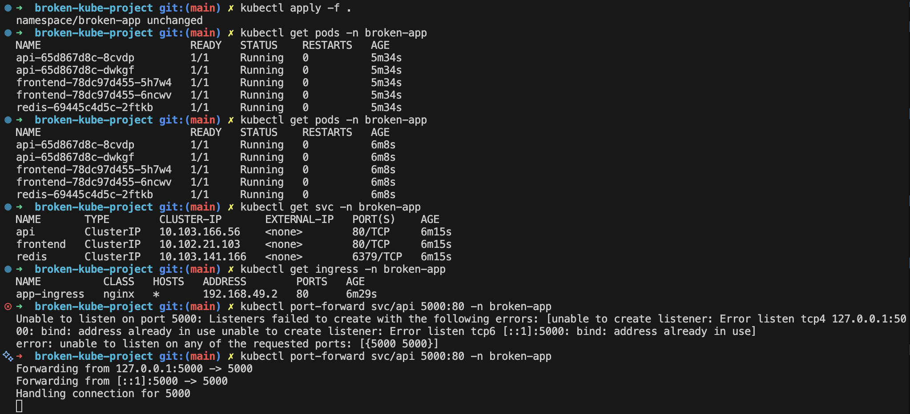
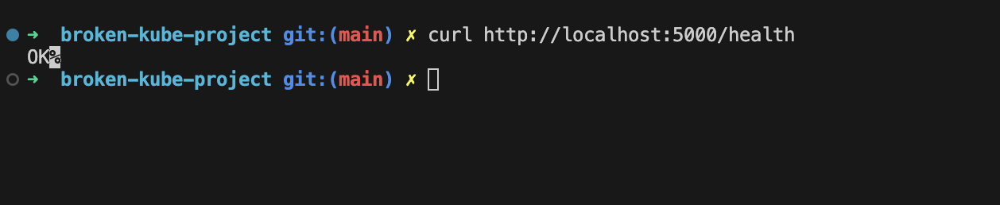

# ☸️ Broken Kubernetes Project

<p align="center">
  
</p>

<p align="center">
  <b>Débogage et remise en état d'une application Kubernetes cassée</b><br>
  TP pratique DevOps / Kubernetes
</p>

<p align="center">
  
  
  
  
</p>

---

## 🎯 Objectif du projet

Ce projet simule un **incident réel en production** sur Kubernetes.

Une application était déjà déployée, mais plusieurs erreurs de configuration empêchaient son bon fonctionnement.

Mission :

- Diagnostiquer les problèmes
- Corriger uniquement ce qui est cassé
- Rétablir le fonctionnement complet
- Vérifier l’infrastructure finale

---

## 🧱 Architecture de l’application

Le cluster contient :

- 🌐 **Frontend** → Nginx
- ⚙️ **API** → Service Python HTTP
- 🧠 **Redis**
- 🚪 **Ingress**
- ☸️ **Namespace Kubernetes**

```text
Internet
   ↓
Ingress
   ↓
Frontend (Nginx)
   ↓
API
   ↓
Redis
```

---

## 🛠️ Technologies utilisées

- Kubernetes
- Minikube
- kubectl
- Nginx
- Python
- Redis
- YAML

---

## 🚨 Les 9 anomalies corrigées

| # | Problème détecté | Correction |
|---|------------------|-----------|
| 1 | Mauvaise image frontend (`ngnix`) | Remplacée par `nginx` |
| 2 | Mauvais selector du service frontend | Labels corrigés |
| 3 | Mauvais nom dans l’Ingress (`fronted`) | Corrigé en `frontend` |
| 4 | Mauvais targetPort API (`5001`) | Corrigé en `5000` |
| 5 | Mauvais port de livenessProbe (`80`) | Corrigé en `5000` |
| 6 | Route `/health` absente | Endpoint ajouté |
| 7 | ConfigMap API non injectée | `envFrom` ajouté |
| 8 | Volume Redis non déclaré | Section `volumes:` ajoutée |
| 9 | CPU API trop élevé (`10`) | Ressources optimisées |

---

## 📂 Structure du projet

```text
broken-kube-project/
│── 00-namespace.yaml
│
├── 01-frontend/
│   ├── deployment.yaml
│   └── service.yaml
│
├── api/
│   ├── configmap.yaml
│   ├── deployment.yaml
│   └── service.yaml
│
├── redis/
│   ├── deployment.yaml
│   └── service.yaml
│
├── ingress/
│   └── ingress.yaml
│
└── README.md
```

---

## 🚀 Déploiement

Appliquer tous les manifests :

```bash
kubectl apply -R -f .
```

Vérifier les pods :

```bash
kubectl get pods -n broken-app
```

Vérifier les services :

```bash
kubectl get svc -n broken-app
```

Vérifier l’ingress :

```bash
kubectl get ingress -n broken-app
```

---

## ✅ Validation finale

Tous les objectifs ont été atteints :

- ✅ Tous les pods en Running
- ✅ Aucun restart anormal
- ✅ Frontend accessible
- ✅ API fonctionnelle
- ✅ Redis déployé
- ✅ Ingress opérationnel

---

## 📸 Preuves de fonctionnement

### ✅ Tous les pods en Running

<p align="center">
  
</p>

---

### ✅ Validation finale de l’application

<p align="center">
  
</p>

## 🧠 Méthodologie utilisée

Méthode DevOps réaliste :

1. Observer
2. Identifier le symptôme
3. Trouver la cause
4. Corriger précisément
5. Vérifier à nouveau

---

## 📚 Compétences travaillées

- Débogage Kubernetes
- Compréhension Services / Labels / Selectors
- Utilisation d’Ingress
- Readiness / Liveness probes
- ConfigMaps
- Gestion des ressources
- Méthodologie de production

---

## 👨‍💻 Auteur

Projet réalisé par **Hugo** dans le cadre d’un TP Kubernetes.

---

<p align="center">
  
</p>
